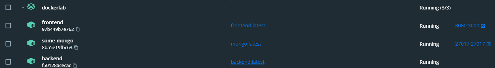
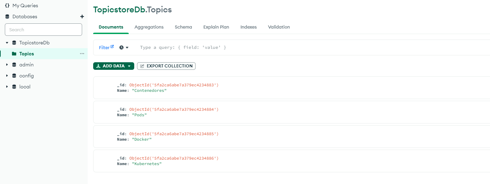
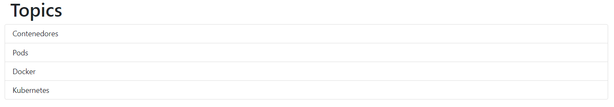
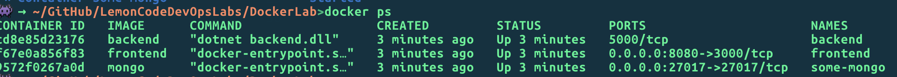

#Laboratorio Docker

En primer lugar deberemos crear los archivos `DockerFile` tanto en el directorio de frontend como en el de backend. Este `Dockerfile` contiene los pasos para construir nuestra imagen de docker que posteriormente sera utilizada dentro del `docker-compose` para crear nuestros contenedores.

Una vez tenemos el  archivo de docker-compose creado, para desplegar este deberemos movernos al directorio raiz y ejecutar el siguiente comando: 

```
 docker-compose -f "ejercicio2-deploy.yaml" up -d 
```

Una vez desplegado, comprobamos que todos los contenedores estan activos desde la applicacion de docker destop: 



Para comprobar que todos los contenedores de la red estan bien comunicados, añadimos desde un cliente de mongo un seguido de documentos dentro de la coleccion Topics del siguiente modo: 


Desde el navegador accediendo a `http://localhost:8080` se debería ver toda la información que hemos añadido en la base de datos: 


Gracias al volumen que hemos creado para el contenedor `some-mongo`, podemos persistir los datos que contiene la colección Topics aunque los contenedores se paren.

Una vez esta todo desplegado, si queremos parar algun contenedor utilizamos el siguiente comando :
```
docker stop {container-id}
```
obtenemos el container-id mediane 'docker-ps' obteniendo el siguiente output por consola : 


Si queremos parar todos los contenedores utilizaremos el siguiente comando. 
```
docker stop $(docker ps -a -q)
```
O si queremos eliminar un únco contenedor indicandole el `{contenierId}` del contenedor: 
```
docker stop {conteinerId}
```

Por último si queremos eliminar los contenedores realizamos el siguiente comando, en este caso si quieremos eliminar el contendor del frontend: 
```
docker rm frontend
```

O por el contrario si queremos eliminar todos los contenedores: 
```
docker rm {ps -a -q}
```

