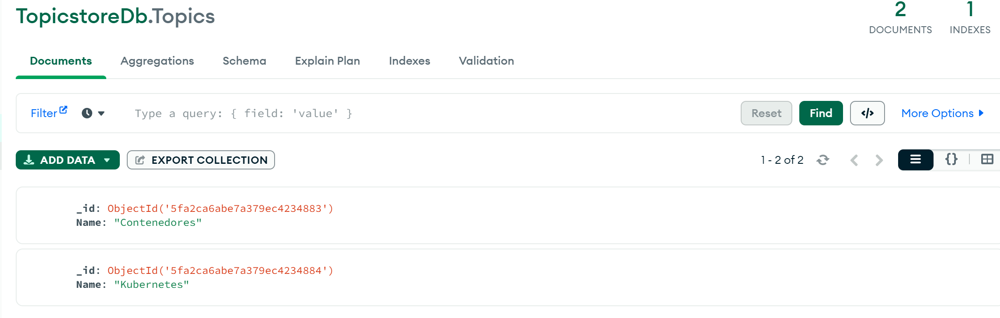

# Laboratorio Docker Ejercicio 1

En primer lugar debemos construir tanto las imagernes de frontend como la de backend.Una vez comletados los respectios `Dockerfile` lanzamos el comando de `docker build` tanto para el Dockerfile de frontend como para el de backend: 
```
docker build -t backend . 
```
```
docker build -t frontend . 
```

En la app de docker vemos como aparecen las imagenes creadas


Una vez estan creados estos archivos, creamos la red `lemoncode-challenge` con el siguiente comando: 
```
docker network create lemoncode-challenge
```


<>
Para crear el contenedor de mongo llamado some-mongo, indicandole el puerto por el que queremos acceder al contenedor su nombre, la red (loemoncode-challenge) y indicamos también el volumen dondde va a persistir los datos:
```
docker run -d --name some-mongo -p 27017:27017 --network lemoncode-challenge -v mongodbdata:/dbdata mongo
```

Para el backend, necesitamos que este tenga mapeado el puerto `5000` con el siguiente comando : 
```
docker run -d --name backend -p 5000:5000 --network lenmoncode-challenge backend
```

Para el frontend, debemos mapear el puerto `8080` al puerto `3000` del contenedor : 

```
docker run -d --name frontend -p 8080:3000 --network lenmoncode-challenge frontend
```

Finalmente una vez tenemos todos los contendores montados, verificamos que todo funciona correctamente. En primer lugar creamos una coleccioón llamada `TopicsDb` y añadimos varios registros:


Una vez tenemos esto levantado, accedemos a  http://localhost:8080 y comorobamos que los registros añadidos aparecen correctamente en nuestro frontend:
