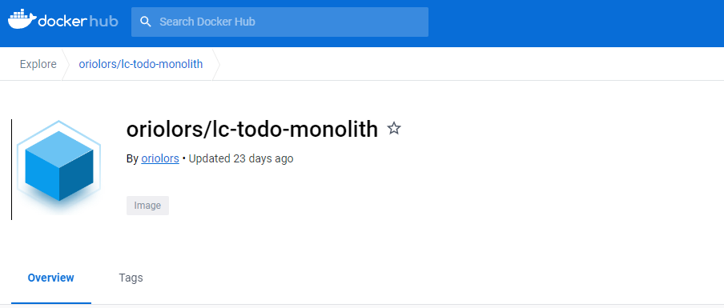
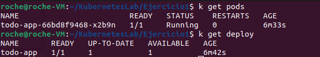
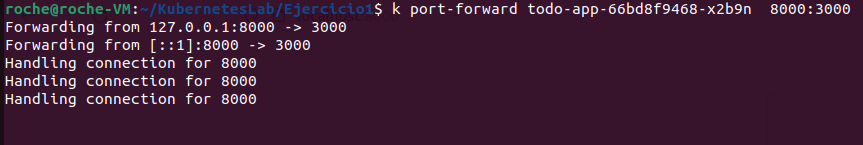
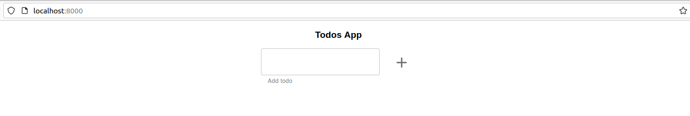
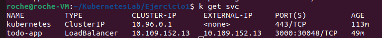
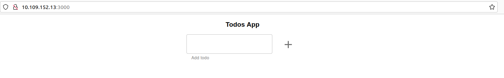

# Kubernetes Lab 

### Ejercicio 1. Monolito en memoria.

Para este primer ejercicio, debemos "pushear" la imagen de docker de nuestro proyecto a dockerhub, con tal de que nuestros contenedores puedan hacer pull de esta imagen:



## Paso 1. Crear todo-app

Una vez nuestra imagen de docker esta publicada en el hub de docker, procedemos a crear el archivo de deployment de nuestros pods. Ademas podemos guardar las variables de entorno en un archivo `configmap` : 

ConfigMap: 

```

apiVersion: v1
kind: ConfigMap
metadata:
  name: env-todo-app
data:
  NODE_ENV: Dev
  PORT: '3000'

```

Deploy : 

```

apiVersion: apps/v1
kind: Deployment
metadata:
  name: todo-app
spec:
  selector:
    matchLabels:
      app: todo-app
  template:
    metadata:
      labels:
        app: todo-app
    spec:
      containers:
      - name: todo-app
        image: oriolors/lc-todo-monolith
        ports:
        - containerPort: 3000
        envFrom:
        - configMapRef:
          name: env-todo-app

```

Una vez creado el archivo de deployment, aplicamos este mediante la instruccion `kubectl apply -f deploy.yaml` desde el directorio donde esten nuestros archivos de configuración del cluster, y mediante las instrucciones `kubectl get pods` y  `kubectl get deploy` podremos ver nuestros pods y deployments creados, en nuestro caso estos estan funcionando correctamente: 



Para acabar de vierificar que nuestro deployment se ha configurado correctamente, podemos hacer un port forwarding del puerto `3000` configurado en nuestro contenedor, mapeado al puerto `8000`:



Una vez hecho el port-forward podemos acceder desde el navegador a la direccion `localhost:8000` : 



 ## Paso 2. Acceder a todo-app desde fuera del clúster

En esta sergunda parte, necesitamos que nuestro cluster sea accesible desde fuera. Para ello creamos un service de tipo `load balancer`. 

```

apiVersion: v1
kind: Service
metadata:
  name: todo-app
spec:
  selector:
    app: todo-app
  ports:
  - port: 3000
    targetPort: 3000
type: LoadBalancer

```

Y Applicamos este archivo mediante `kubectl apply -f loadbalancer.yaml`

Una vez creado el servicio de `load-balancer`, mediante el comando `mikube tunnel` resolvemos una direccion ip para acceder a nuestro cluster desde fuera del cluster.



Copiamos esta dirección `10.109.152.13:3000` en un navegador y comprovamos que nuestra todo-app es ahora accesible mediante esta Ip: 



